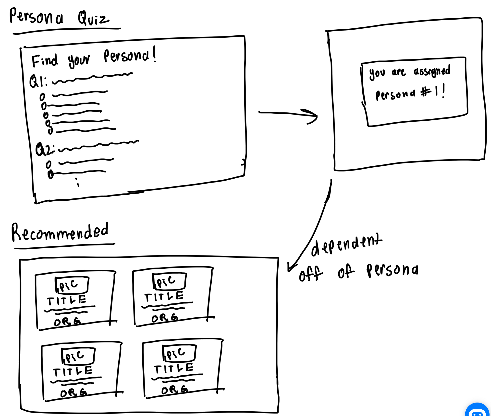

# Aloha Archives

# Table of Contents
- [Project Goals](#project-goals)
- [Milestone 1](#milestone-1)

## Team Contract
To see the team contract for this project, click [here](https://docs.google.com/document/d/1P-EUtJDOpm3DrSK2WEZ7VvwGKifwNqZ6sU6OpzdtIxc/edit?usp=sharing).

## Github Orginization
To see the Github Orginization associated with this project, go to [https://github.com/Aloha-Archives](https://github.com/Aloha-Archives)

## Deployment
Our project is currently being deployed at, [https://aloha-archives.vercel.app/](https://aloha-archives.vercel.app/)

## Project Goals
The existing Hawaii Open Data portal is challenging for the average citizen to navigate. Citizens often encounter difficulties due to
inconsisten dataset tagging, lack of data visualizations, and limited accessibility for those without technical skills. Aloha Archives will provide 
an intuitive and visually appealing portal that personalizes data access for citizens based on their needs. This portal will feature:

- **Citizen Personas**: Customized experiences for different user profiles (e.g., students, researchers, residents) with relevant data and visualizations.
- **Enhanced Navigation**: Simplified and clear layout with accessible search filters for datasets by category, organization, or tags.
- **Data Visualization Links**: Links to existing visualizations.

This application will serve as a unified platform for organizing, uploading, and exploring datasets relevant to various user personas in Hawai’i, such as education, community, and professional users.

## Goals for the System to Provide
There are three main roles we want the system to be able to provide:
- **Users**: Can log in, set up profiles, and personalize their experience based on an optional quiz to help determine a user “persona.”
- **Admins**: Have additional capabilities to manage and edit datasets, oversee organization information, and handle system-wide operations.
- **Guests**: May browse datasets without options to save their favorites.

We hope the app will offer a clean and interactive interface, including:
- **Comprehensive search page**: With filtering options.
- **Individual dataset pages**: Showcasing details like topic, view count, and organization information.
- **User profile**: Reflecting preferences or personas for tailored dataset recommendations.
- **Admin home page**: With tools for uploading, editing, and managing datasets.
- **Legal information**: Such as terms of use, privacy policy, and contact details accessible in the footer for transparency and compliance.

The following are examples of possible case ideas we hope the system to cover:
- **Regular User**:
    - **First visit**: Go to the landing page, register, take quiz, get personalized data recommendation, visit dataset page, add favorites, go to favorites, compare data in favorites list, and enjoy personalized data insights.
    - **Return visit**: Same steps as the first time, but without registering.
- **Admin**: Go to the landing page, log in, visit upload page, upload dataset, go to edit dataset page, edit or remove datasets, and experience a sense of accomplishment.

## Mockup Pages
Some mockup pages include:
- **Landing Page**
    - Header with Login
    - Search bar
    - Trending section
    - Footer
- **User Home Page**
    - Profile Page
    - Optional quiz for personalized experience
        - Helps determine “persona” (e.g., Education, Community, Professional)
    - Saved datasets with options to add or remove
- **Admin Home Page**
    - Separate header
    - Options to upload and edit datasets
    - Profile Page with Organization Icon, Description, etc.
- **Upload Page** (for datasets)
- **Edit Dataset Page**
- **Search Page**
    - Search bar
    - Search results
    - Filter component on the left
- **Dataset Page**
    - Title, Topic, View count
    - Dataset preview in table format
    - Organization Logo and data description
- **Footer**
    - Legal links (terms of use, privacy policy, about us, contact us, etc.)

# Milestone 1
Milestone 1 aimed to establish a basic outline of our website’s design. Our primary focus was on creating the visual structure and layout to resemble a functional website, without yet implementing full functionality. By setting up the foundational framework, we can efficiently add and refine features in future milestones.

Milestone 1 was managed using [Aloha Archives GitHub Project Board M1](https://github.com/orgs/Aloha-Archives/projects/1/views/1):

Some of the pages we will have on Aloha Archives consists of:
Data Explore Page

Persona Quiz and Recommendation Pages

Data Display Page

# Milestone 2
Milestone 2 was managed using [Aloha Archives GitHub Project Board M2](https://github.com/orgs/Aloha-Archives/projects/3):